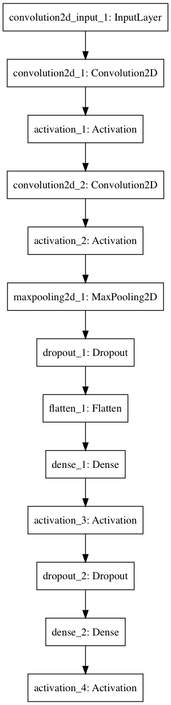

# MNIST for CoreML (CNN)

### Description
This is the MNIST dataset implemented in Apple's new framework CoreML. The MNIST dataset can classify handwritten (drawn) digits from an image and outputs a prediction from 0-9. The model was built with Keras 1.2.2.

To test this model you can open the `MNISTPrediction.xcodeproj` and run it on your device (iOS 11 and Xcode 9 is required). To test further images just add them to the project and replace my testing with yours.

An example of a handdrawn digit would look like this: 

**Be aware that your images have to have a black background and white line color!**

Furthermore your images resolution has to be 28x28px. If yours is bigger just use my `UIImage` rescaling extension I wrote. The line width has to be thick enough to be recognized as a digit.

### Information about the model
This CNN model achieves up to 99.5% of accuracy and the structure is as follows:

